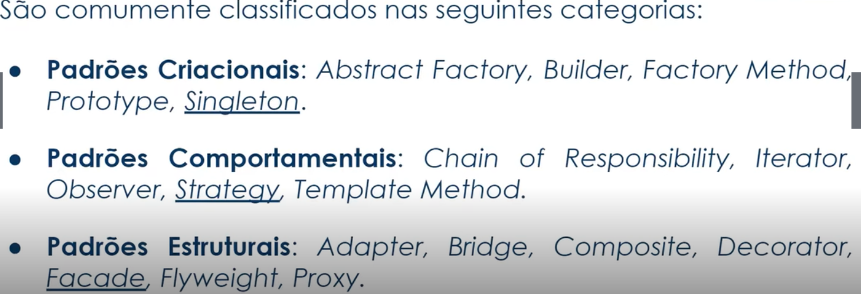

# Design Patterns com Java:

<strong>São soluçoes consolidadas para problemas recorrentes no desenvolvimento e manutenção de software orientado a obketos.</Strong>

O livro <strong>DISIGN PATTERNS: Elements of Reusable Object-Oriented Software</strong>(1995)  é a principal referência sobre o tema, a qual os autores <strong>Gamma, Helm, Johnson</Strong> e <Strong>Vlissides</Strong> connhecidos como <Strong> "Gang of Four(GOF)"</Strong>

# PADRÃO DE PROJETOS
